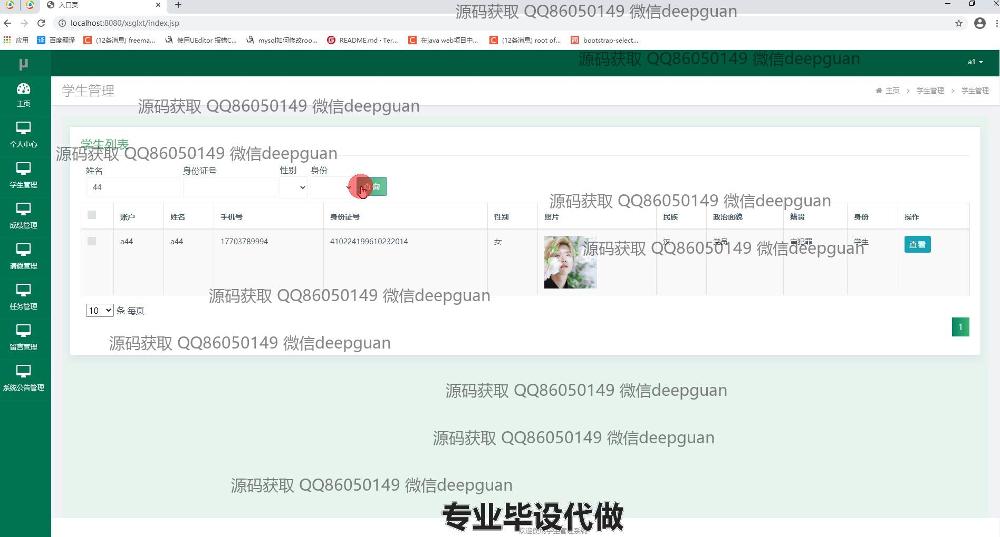
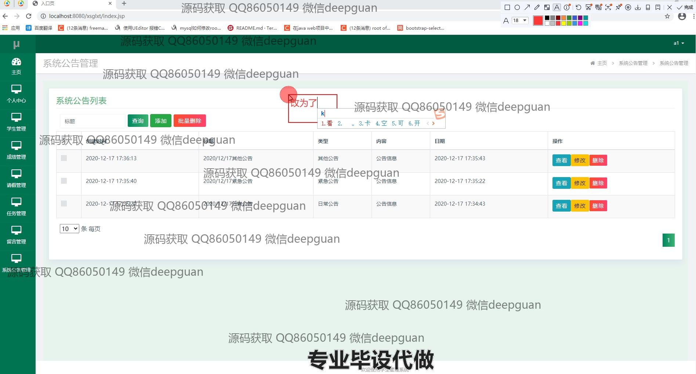
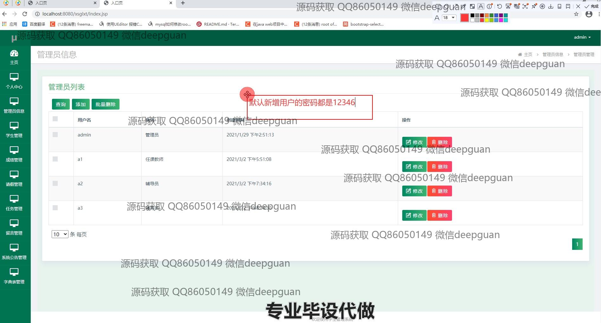

<h1 align="center">基于java和mysql的多角色学生管理系统</h1>

## 简介
多角色学生管理系统：角色分为管理员、教师、学生；功能包括学生管理、成绩管理、请假管理、任务管理、留言和公告管理。系统提高了操作效率和信息管理的便利性。    --计算机毕业设计源码；毕设源码；java毕业设计源码

## 联系方式

<h3 align="center">获取完整代码与数据库文件 + 微信：deepguan QQ: 86050149 QQ群: 783742310</h3>

<h3 align="center">可帮忙远程部署 包运行成功！提供远程部署、修改代码、设计文档指导、代码讲解等服务！</h3>

## 功能介绍（完整见运行截图）
管理员： 基本功能包括账号注册和登录，用户角色的维护，以及系统设置和公告发布。管理员可以管理和审核学生、教师和其他用户的信息，处理请假和成绩录入请求，同时负责任务分配和留言管理的监督。此外，管理员还能够通过各种查询工具生成报表并分析系统使用情况，从而优化系统功能和用户体验。

教师： 其功能主要集中在学术管理，包括记录和管理学生成绩，对学生的请假申请进行审核，分配和管理学习任务以及回复学生留言。教师可以查看学生的详细信息和学术统计，发布课程公告，并参与系统公告的维护。同时，教师角色能够结合教学计划执行任务分配的功能，优化教学流程并提高学生的学业表现。

学生： 学生可以通过系统查看和更新个人信息，查询课程安排和成绩报告。角色允许学生提交请假申请，自主参与和管理课程任务，并在公告模块中获取系统或教学相关信息。日常使用中，学生可通过留言系统与教师或管理员交流，获取所需帮助，此外，学生还可以通过系统提供的平台进行校内活动的报名和反馈。

来访者： 系统提供简易版功能界面，允许未注册或未登录用户了解平台的基本功能和公告信息。来访者可以查看某些如公告或学校课程的大致信息，但大部分操作需要注册或登录。因此，来访者可以选择注册为学生、教师或管理员角色，以便访问专属的功能和服务。

## 运行截图

本代码来源于网络,仅供学习参考使用!

